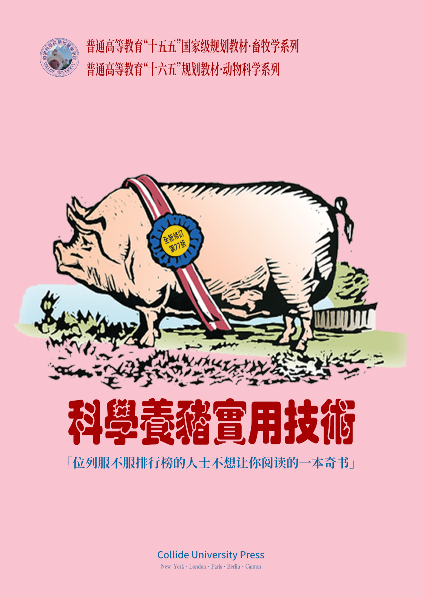

# Welcome {-} 

 

「逻辑」有很多种，「逻辑学」也有很多种。不同的人学习逻辑学有不同的目的。本笔记中的「逻辑学」知识主要服务于语言、思维的分析，不追求逻辑学在其他领域的功能。

本笔记大致列出逻辑基础学习阶段的主要材料，主要参考（chāoxí）以下课本攒集而成：

:::{.freebox}
<b>参考文献：</b>

1. 徐明, 2008. **符号逻辑讲义[M]**.武汉:武汉大学出版社.
2. 胡龙彪,黄华新, 2006. **逻辑学教程[M]**.杭州:浙江大学出版社.
3. 黄华新,张则幸, 2011. **逻辑学导论（第二版）[M]**.杭州:浙江大学出版社.
4. 安德鲁·辛普森, 2005. **离散数学导学[M]**.冯速,译.北京:机械工业出版社.
5. Tidman P, Kahane H, 2002. **Logic and Philosophy: A Modern Introduction[M]**. Ninth. Boston: Cengage Learning.
6. Smith N J J, 2012. **Logic: The Laws of Truth[M]**. New Jersey: Princeton University Press.
7. Copi I M, Cohen C, Rodych V, 2018. **Introduction to Logic[M]**. New York: Routledge.
8. Bergmann M, Moor J, Nelson J, 2014. **The Logic Book[M]**. Sixth. New York: McGraw‑Hill.
:::

其中，直接取自《符号逻辑讲义》的材料最多，取自《逻辑学导论》較多，素樸集合論、表列演算則直接取自完全開源的 [Open Logic Project](https://builds.openlogicproject.org/) 項目源碼。

## Acknowledgements {-}

以上参考书之作者。

 
   
  

**Editorial comments**

有屁请在此处放，看看谁的屁更响。

